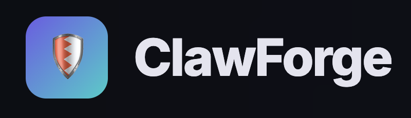
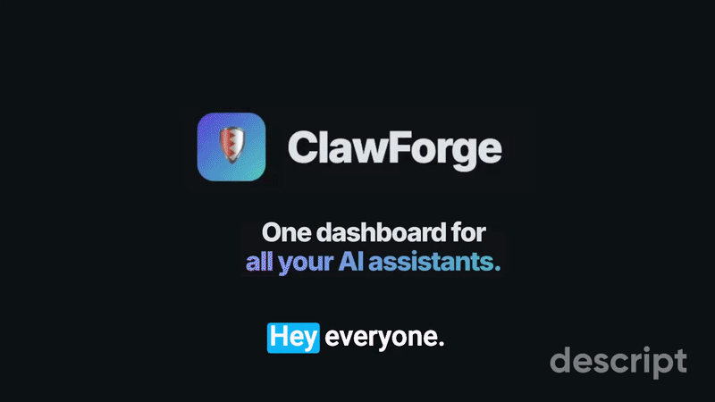

<p align="center">
  
</p>

<h1 align="center">ClawForge</h1>

<p align="center">
  <a href="LICENSE">
    
  </a>
  <a href="https://github.com/ClawForgeAI/clawforge/actions/workflows/ci.yml?query=branch%3Amain">
    
  </a>
  <a href="https://github.com/ClawForgeAI/clawforge/actions/workflows/github-code-scanning/codeql?query=branch%3Amain">
    
  </a>
  <a href="https://github.com/ClawForgeAI/clawforge/releases">
    
  </a>
  <a href="https://github.com/ClawForgeAI/clawforge/pkgs/container/clawforge">
    
  </a>
</p>

<!-- <p align="center">
  
</p> -->

<p align="center">
  <strong>The control plane for AI agents at work.</strong>
</p>

<p align="center">
  Open, vendor-neutral operations layer for multi-agent AI ecosystems. Govern Claude Code, OpenAI Agents, LangGraph, MCP servers, OpenClaw, and custom enterprise agents from one operational surface.
</p>

---

## What ClawForge is

ClawForge is a **control plane and operator console for AI agents at work**. It centralises policy, audit, and incident response across mixed agent runtimes, while keeping enforcement local to where the agent actually runs.

It is not another detection-shaped security product (prompt scanners, output monitors, risk-flag dashboards). Those tools watch behaviour at the runtime layer. ClawForge is the operations surface above them — who approves what, where policy lives, how an incident moves through the fleet, and what evidence exists after the fact.

The project's stance: **the runtime layer will keep changing**. An operations layer that only works against one vendor's runtime becomes a liability the day a second runtime arrives. ClawForge is therefore vendor-neutral by intent, open by design, and self-hosted by default.

## The operator gap ClawForge addresses

1. **Fragmented runtimes** — Claude Code, OpenAI Agents, LangGraph, internal workflows, all with disconnected operators and disconnected policy.
2. **Untrusted MCP servers** — no allow-listing, approval flow, or audit trail for the capabilities agents are actually reaching.
3. **Shadow AI workflows** — autonomous agents touching production systems without governance.
4. **No queryable evidence** — security and legal cannot reconstruct what an agent did; logs are scattered and inconsistent.
5. **No containment path** — kill switches and approval flows are scattered across tools, or missing entirely.

## Architecture

Four layers, vendor-neutral by design. ClawForge meets each runtime where it lives — local enforcement where the runtime supports it, MCP proxying where it doesn't, and an append-only audit pipeline either way.

| Layer                       | Role                                                                                                                                                                       |
| --------------------------- | -------------------------------------------------------------------------------------------------------------------------------------------------------------------------- |
| **Agents**                  | The assistants themselves: Claude Code, OpenClaw, OpenAI Agents, LangGraph, MCP servers, Microsoft AGT, custom enterprise agents.                                          |
| **Adapters & interception** | Runtime-specific surfaces that translate ClawForge policy into something the agent's runtime understands — SDK hooks, MCP proxying, AGT integration, native runtime hooks. |
| **Governance runtime**      | Local enforcement, audit emission, heartbeat behaviour. Sits close to the agent rather than waiting on a round-trip to the cloud.                                          |
| **Control plane**           | The operator surface: policy authoring, audit federation, approval queues, emergency state.                                                                                |

See [Architecture & How It Works](docs/architecture.md) for trust boundaries, control flows, and the database schema.

## Capabilities

Everything flows through **policy, approval, audit, and response**. One operator model. One queryable event stream. One containment path.

| Capability                           | What it does                                                                                                     |
| ------------------------------------ | ---------------------------------------------------------------------------------------------------------------- |
| **Multi-agent fleet inventory**      | Mixed-runtime view of every connected agent: where it runs, what version, which policy, last heartbeat.          |
| **Centralized policy engine**        | One operator model for permissions, tool scopes, approval thresholds, and audit depth — published once.          |
| **MCP governance console**           | Operator surface for the MCP catalog, approval queue, and audit query.                                           |
| **Approval workflows**               | Operator approvals for tool scopes, MCP servers, policy changes, and shell access — routed and timed-out.        |
| **Audit & evidence pipeline**        | Append-only event store. Query by agent, runtime, policy decision, or operator. Export evidence packs.           |
| **Fail-secure kill switch**          | Heartbeat-bounded propagation with a local fail-secure fallback. Containment that does not require connectivity. |
| **AGT-compatible policy layer**      | Translates ClawForge policy into Microsoft AGT primitives where the runtime supports it.                         |
| **Risk signals & anomaly detection** | Surfaces unusual tool-call patterns, policy denials, and approval-rate drift across the fleet.                   |


## Relationship to Microsoft AGT

AGT is the enforcement substrate. ClawForge is the operations layer above it. For AGT-supported runtimes, AGT does the per-tool-call enforcement, the MCP gateway, and the append-only audit; ClawForge writes the policy AGT enforces, surfaces AGT's approval hooks into an operator queue, and federates AGT's audit log into the cross-runtime event store. For runtimes outside AGT (Claude Code, OpenClaw, custom agents), ClawForge handles interception itself via SDK adapters, runtime hooks, or its own MCP proxy. **The operator surface stays the same either way.**

ClawForge is not a Microsoft product and does not replace AGT. See [docs/BOOT.md](docs/BOOT.md) for the full breakdown.

## Quick Start

```bash
git clone https://github.com/ClawForgeAI/clawforge.git
cd clawforge
cp .env.example .env
docker compose up --build
```

Once running:

- **Admin Console** — [localhost:4200](http://localhost:4200)
- **API** — [localhost:4100](http://localhost:4100)
- **Login** — `admin@clawforge.local` / `clawforge`
- **One-off seed** — `docker compose run --rm seed`

> For manual setup, SSO configuration, and connecting a runtime adapter, see the [Setup Guide](docs/setup.md).

## Documentation

| Guide                                                          | Description                                                                             |
| -------------------------------------------------------------- | --------------------------------------------------------------------------------------- |
| [Boot Context](docs/BOOT.md)                                   | Product vision, four-layer architecture, AGT relationship, kill-switch model            |
| [Setup Guide](docs/setup.md)                                   | Docker, manual setup, SSO, connecting a runtime adapter                                 |
| [Architecture & How It Works](docs/architecture.md)            | Package structure, control flows, trust boundaries, database schema                     |
| [Platform Technical Strategy](docs/technical-strategy.md)      | Multi-runtime architecture direction, package extraction plan, implementation phases    |
| [API Reference](docs/api-reference.md)                         | Every endpoint with request/response examples                                           |
| [E2E Onboarding Guide](docs/e2e-guide.md)                      | Full walkthrough from zero to managed fleet                                             |
| [Configuration](docs/configuration.md)                         | Adapter config, server env vars, admin console env vars                                 |
| [AI Agentic Development Guide](docs/ai-agentic-development.md) | Issue format, write context, exit plans, and testing standards for AI-delivered changes |
| [Roadmap](docs/roadmap.md)                                     | Runtime support and release history                                                     |

## Trust points at a glance

- MIT licensed
- Self-hosted
- Vendor-neutral
- AGT-compatible
- MCP-native
- Queryable audit trail
- SSO / OIDC ready
- Fail-secure kill switch

## Contributing

Contributions are welcome — see [CONTRIBUTING.md](CONTRIBUTING.md). Security disclosures go to **contact@clawforge.co** (see [SECURITY.md](SECURITY.md)).

## License

MIT
