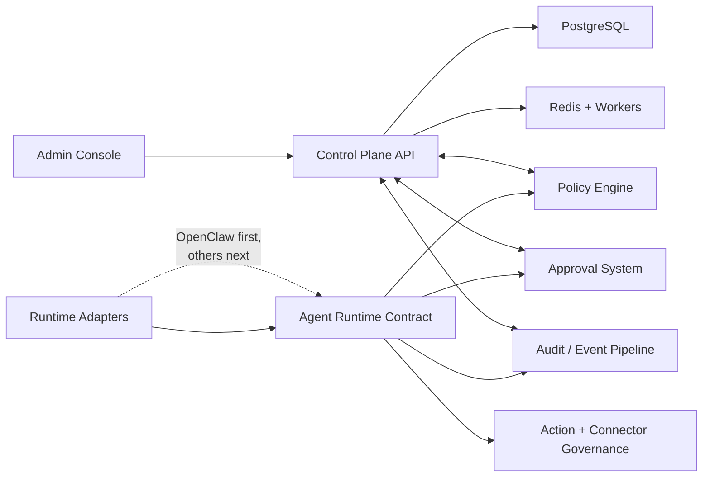

# Platform Technical Strategy

## Purpose

This document turns the current ClawForge foundation into a repo-ready technical strategy for the next stage of the product.

It is aligned with:

- the current product repo and stack in `plugin/`, `server/`, and `admin/`
- the public architecture and roadmap in `docs/architecture.md` and `docs/roadmap.md`
- the broader product direction in `clawforge-hq/knowledge-base/vision.md`

The core decision is:

**Keep the current stack, but shift the internal design from an OpenClaw-first product into platform primitives for governing many agent runtimes.**

ClawForge should evolve from thinking in terms of:

- OpenClaw plugin
- control-plane server
- admin dashboard

to thinking in terms of:

- control plane
- policy engine
- agent runtime contract
- adapter layer
- action and connector governance
- approval system
- audit and event pipeline

This is an additive refactor, not a rewrite.

## Architecture Goals

1. Preserve the current production foundation: TypeScript, pnpm monorepo, Fastify, PostgreSQL, Drizzle, Next.js, and plugin-side enforcement.
2. Reframe the product around reusable platform capabilities instead of OpenClaw-specific implementation details.
3. Support multiple packaged and custom agent runtimes through one runtime contract and a thin adapter model.
4. Centralize policy evaluation so the same rules apply across server routes, adapters, approvals, admin validation, and future workers.
5. Expand governance from tool allow and deny lists into a broader action governance model.
6. Make audit, approvals, connector control, and emergency response first-class platform services rather than side features.
7. Keep the single-org self-hosted experience simple now while preparing the internals for managed and enterprise packaging later.
8. Prefer clean package boundaries, shared contracts, and append-only event flows over framework churn or early microservices.

## Current Foundation To Preserve

The current repository already has the right base for governance:

| Current component         | Keep | Why it stays                                                                                |
| ------------------------- | ---- | ------------------------------------------------------------------------------------------- |
| `plugin/`                 | Yes  | Client-side enforcement is the right trust boundary for local and semi-local agent runtimes |
| `server/`                 | Yes  | Fastify is a strong fit for a control plane API, event ingestion, and policy services       |
| `admin/`                  | Yes  | Next.js works well for dashboards, approvals, audit views, and fleet administration         |
| PostgreSQL + Drizzle      | Yes  | Good foundation for policy state, audit records, approvals, and future projections          |
| Heartbeat + policy sync   | Yes  | Still useful as the resilience path even after real-time control is added                   |
| Audit trail + kill switch | Yes  | These are part of the product core, not temporary v1 features                               |

The repo should continue to treat the current OpenClaw integration as the first adapter, not as the long-term architecture boundary.

## Strategic Architecture Direction

### Platform Primitives

The platform should be organized around these internal primitives:

| Primitive                     | Responsibility                                                                               |
| ----------------------------- | -------------------------------------------------------------------------------------------- |
| Control plane                 | Org state, runtime registry, policy distribution, approvals, identity, admin APIs            |
| Policy engine                 | Central evaluation of access, risk, kill switch, approvals, overrides, and scope inheritance |
| Agent runtime contract        | Canonical lifecycle and event model for all governed runtimes                                |
| Adapter layer                 | Runtime-specific integrations for OpenClaw, Claude Code, Codex, and custom agents            |
| Action governance             | Normalized representation of risky behavior beyond just tools                                |
| Tool and connector governance | MCP servers, connector visibility, tool approval, and connector access policy                |
| Approval system               | Human-in-the-loop review for risky actions, access elevation, and policy changes             |
| Audit and event pipeline      | Durable append-only events, projections, exports, live streams, and anomaly inputs           |
| Identity and auth             | Separate identity models for humans, devices, runners, services, and agent instances         |

### Target System Shape



### Architecture Principles

- **OpenClaw is the wedge, not the limit.** The repo should preserve the current integration while extracting the reusable core below it.
- **Local enforcement stays important.** Where runtimes support pre-action hooks or client-side controls, ClawForge should continue enforcing as close to execution as possible.
- **One policy engine, many callers.** Route handlers, adapters, admin previews, approval checks, and workers should all call the same evaluation library.
- **Govern actions, not only tools.** Shell access, file writes, repo pushes, network calls, secret access, and MCP invocations should use the same governance language.
- **Events are a source of truth.** Operational views, alerts, exports, and analytics should be derived from structured event streams rather than one-off logging paths.
- **Additive refactor over rewrite.** The fastest safe path is to extract shared packages from the current codebase while preserving behavior.

## Target Package Structure

### Near-Term Workspace Direction

Keep the current top-level product packages and add shared internal packages under `packages/`.

Given the current published package naming, new internal libraries should stay under the existing `@clawforgeai/*` scope unless a broader package rename is planned separately.

Initial workspace shape:

```text
clawforge/
├── plugin/                 # current OpenClaw adapter, kept in place initially
├── server/                 # control plane API
├── admin/                  # admin console
└── packages/
    ├── contracts/          # shared schemas and runtime contracts
    ├── policy-engine/      # policy evaluation and scope resolution
    ├── agent-sdk/          # adapter SDK and runtime lifecycle helpers
    ├── audit-events/       # event schemas, writers, projections, export helpers
    ├── auth/               # shared identity/auth types and helpers
    ├── tool-governance/    # action typing, MCP governance, risk rules
    └── ui/                 # shared admin UI primitives, tables, filters, badges
```

Recommended `pnpm-workspace.yaml` direction:

```yaml
packages:
  - plugin
  - server
  - admin
  - packages/*
```

### Package Responsibilities

| Package                    | Responsibility                                                                                                       |
| -------------------------- | -------------------------------------------------------------------------------------------------------------------- |
| `packages/contracts`       | Canonical Zod and TypeScript schemas for policies, events, approvals, runtime state, heartbeats, runs, and artifacts |
| `packages/policy-engine`   | Evaluate policy decisions for actions, tool access, connector access, kill switch, risk tiers, and scope inheritance |
| `packages/agent-sdk`       | Runtime adapter contract, shared lifecycle helpers, adapter registration, batching, retries, and policy sync hooks   |
| `packages/audit-events`    | Event types, append-only writers, event projections, retention helpers, export formats, and live stream payloads     |
| `packages/auth`            | Shared identity models for users, devices, service accounts, runners, and agent instances                            |
| `packages/tool-governance` | Action taxonomy, connector rules, MCP policy helpers, tool metadata, and approval-trigger logic                      |
| `packages/ui`              | Shared admin-facing components for approvals, event tables, policy previews, agent cards, and status surfaces        |

Approval workflows should initially share contracts and server services. Extract a dedicated approval package only once multiple adapters need the same local approval client logic.

### Adapter Strategy

The repo should avoid a large directory rename immediately. The recommended sequencing is:

1. Keep `plugin/` as the OpenClaw adapter while extracting shared packages.
2. Refactor `plugin/` to depend on `packages/contracts`, `packages/policy-engine`, `packages/agent-sdk`, and `packages/audit-events`.
3. Add the next runtime adapter as a new package, for example `packages/claude-code` or `packages/codex`.
4. Only revisit directory naming once there are at least two adapters and the shared boundaries are stable.

This avoids unnecessary churn in publishing, docs, and changesets while still moving toward a true adapter architecture.

## Runtime Contract

ClawForge should not add each runtime as a one-off integration. It should define one strict runtime interface and implement adapters against it.

### Core Lifecycle Surface

The runtime contract should cover operations such as:

- `registerAgent()`
- `startRun()`
- `pauseRun()`
- `resumeRun()`
- `cancelRun()`
- `requestApproval()`
- `emitEvent()`
- `listTools()`
- `applyPolicy()`
- `reportUsage()`
- `collectArtifacts()`

### Contract Requirements

Every adapter should map its runtime-specific hooks into the same concepts:

| Concern               | Contract expectation                                                                           |
| --------------------- | ---------------------------------------------------------------------------------------------- |
| Identity              | Every adapter reports human, runtime, device or runner, and agent-instance identity separately |
| Session and run state | Runs are started, updated, completed, failed, paused, or cancelled through shared events       |
| Action requests       | Tool calls and other risky operations are normalized before policy evaluation                  |
| Approvals             | Adapters can request approval and resume when a decision arrives                               |
| Policy sync           | Adapters can fetch policy, detect version drift, and apply kill switch updates                 |
| Artifacts             | Adapters can attach outputs, logs, or references to governed runs                              |
| Usage reporting       | Token usage, duration, tool counts, and failure reasons use shared schemas                     |

### Adapter Responsibilities

An adapter should stay thin. Its job is to:

- translate runtime-specific events into ClawForge contract events
- call the shared policy engine before risky actions when the runtime supports it
- upload normalized audit events
- surface approvals and kill switch changes back into the runtime
- manage local caching and offline behavior as required by the runtime

Business rules should not live inside each adapter.

## Policy And Action Governance

### Policy Engine Scope

The policy engine should become the single place that evaluates:

- agent access
- tool access
- connector access
- environment access
- approval requirements
- kill switch state
- org-level overrides
- future team, project, or runtime-level overrides

### Action Governance Model

ClawForge should expand from tool governance to action governance.

Every governed action should normalize into a shared shape with fields such as:

- `action_type`
- `target`
- `risk_level`
- `requested_by`
- `agent_runtime`
- `requires_approval`
- `decision`
- `evidence`

Representative action types:

- `tool_call`
- `shell_exec`
- `file_read`
- `file_write`
- `network_request`
- `mcp_call`
- `repo_push`
- `pull_request_create`
- `deployment`
- `secret_access`
- `plugin_install`

This gives ClawForge one governance language across packaged agents and custom runtimes.

### MCP And Connector Governance

MCP should be treated as a first-class policy surface.

The platform should support:

- allow and deny rules for MCP servers
- per-runtime tool visibility
- connector-level policy overlays
- auto-approve, deny, or human-gate decisions per tool or connector
- audit logs for MCP calls and connector mutations
- future ClawForge-managed MCP services for approvals, policy, audit, and repo guard flows

## Audit, Events, And Observability

### Event Strategy

Audit should evolve from a logging feature into a platform event model.

Canonical event families should include:

- run started
- run completed
- run failed
- action requested
- action allowed
- action blocked
- approval requested
- approval granted
- approval denied
- policy updated
- agent enrolled
- connector accessed
- kill switch activated

### Storage Model

Use an append-only event strategy for governed activity and derive operator views from projections.

Recommended pattern:

1. Write normalized events durably.
2. Build projections for dashboards, approvals, active runs, alerts, exports, and usage summaries.
3. Use workers for asynchronous aggregation, retention, and integration delivery.

This supports:

- human-readable activity feeds
- compliance exports
- live dashboards
- anomaly detection
- risk scoring
- debugging and replay
- usage analytics

### Queue And Worker Direction

Add Redis plus a worker model such as BullMQ once the first shared event pipeline and approval flows are in place.

The initial worker backlog should cover:

- audit ingestion and fan-out
- policy propagation jobs
- compliance exports
- approval reminders
- connector health checks
- anomaly detection
- cleanup and retention
- usage aggregation

### Real-Time Control

Heartbeat polling should remain the fallback path for resilience, but ClawForge should add SSE or WebSocket support for:

- urgent kill switch propagation
- approval notifications
- live run status
- live audit tailing
- fresher admin dashboards

Guiding model:

- polling for resilience
- event push for responsiveness

## Identity, Auth, And Data Model Direction

### Identity Separation

The platform should stop treating all actors as the same kind of identity.

It should distinguish at least:

- human user identity
- device identity
- runner identity
- service account identity
- agent instance identity

This matters because a local laptop runtime, a hosted coding runner, and a backend workflow service should not share the same trust model.

### Data Model Direction

Even while the product remains single-org in UX, the internal schema should prepare for broader scope.

Core entities to design around now:

- `organization`
- `workspace` or `project`
- `team`
- `user`
- `role`
- `agent_runtime`
- `agent_instance`
- `run`
- `action`
- `policy_scope`
- `approval_request`
- `approval_decision`
- `audit_event`
- `connector_registry`
- `artifact`

The goal is not to ship multi-org UX immediately. The goal is to avoid schema choices that make future packaging painful.

### Compliance-Friendly Defaults

The architecture should treat compliance evidence as a core outcome from day one:

- append-only or tamper-aware audit strategy
- retention controls
- exportable structured audit data
- admin action logging
- traceability from policy to decision to action to output
- future evidence bundle generation

## Roadmap Alignment

This strategy complements the public roadmap rather than replacing it.

| Strategy phase              | Public roadmap alignment                                           | HQ roadmap alignment                              |
| --------------------------- | ------------------------------------------------------------------ | ------------------------------------------------- |
| Platform foundation         | closes architecture gaps underneath `v0.2.0` and `v0.3.0` features | matches Phase 1 multi-platform foundation         |
| First multi-agent expansion | supports the path to `v1.0.0` multi-agent features                 | matches the move beyond OpenClaw-only positioning |
| Custom-agent platform       | expands into SDK and orchestration support                         | matches medium-term custom-agent direction        |
| Enterprise hardening        | supports later visibility, compliance, and enterprise controls     | matches compliance and intelligence layers        |

The public roadmap should continue to describe product milestones, while this document defines the internal architecture path needed to deliver them cleanly.

## Implementation Phases

### Phase 1: Platform Foundation Inside The Current Repo

Primary goal: extract shared platform primitives without breaking the current OpenClaw-first product.

Deliverables:

- create `packages/contracts` with policy, approval, heartbeat, audit, and runtime schemas
- create `packages/policy-engine` and move shared policy evaluation into it
- create `packages/audit-events` for normalized event types and writers
- create `packages/agent-sdk` for adapter lifecycle helpers and shared runtime types
- create `packages/auth` for shared identity models and token-related helpers
- create `packages/tool-governance` for action taxonomy, MCP rules, and risk classification
- refactor `plugin/` to consume shared packages while preserving behavior
- keep `server/` and `admin/` using the same contracts for validation, previews, and APIs

Exit condition:

- OpenClaw behavior remains unchanged for policy enforcement, heartbeat, audit upload, and kill switch
- the same policy decision logic is reused across plugin, server, and admin
- the repo is ready to add a second adapter without duplicating schema and policy logic

### Phase 2: First Multi-Agent Expansion

Primary goal: prove the platform model by governing at least one more runtime beyond OpenClaw.

Deliverables:

- add a second adapter such as Claude Code or Codex
- implement the shared runtime contract end to end
- introduce generalized approval workflows beyond skills
- normalize action governance for shell, file, network, repo, and MCP operations
- add real-time approval and kill switch updates with SSE or WebSocket
- introduce richer runtime and agent registry views in the admin console

Exit condition:

- ClawForge can govern at least two distinct runtimes through the same policy, audit, and approval model
- approvals are no longer limited to skill review
- agent registry and activity feed views are based on shared contracts, not runtime-specific payloads

### Phase 3: Custom-Agent Platform

Primary goal: open the platform to internal and custom-built agents.

Deliverables:

- publish a custom-agent SDK on top of `packages/agent-sdk`
- add adapters for orchestration frameworks such as LangGraph and PydanticAI
- support managed runners and non-laptop execution environments
- add usage analytics and richer export pipelines
- expose ClawForge-managed services for approvals, policy checks, or audit access where useful

Exit condition:

- a custom internal agent can integrate without copying server or plugin internals
- the governance model works for both packaged agents and custom workflow agents

### Phase 4: Enterprise Hardening

Primary goal: deepen governance and compliance without reworking the core architecture.

Deliverables:

- deeper RBAC and scoped policy management
- compliance templates and policy packs
- SIEM and webhook integrations
- risk scoring and anomaly pipelines
- private deployment patterns and managed-service packaging support
- multi-org-ready structures and broader enterprise identity support

Exit condition:

- enterprise features layer on top of the existing platform primitives instead of creating new governance silos

## Recommended Initial Execution Order

The first engineering sequence should be:

1. Extract shared contracts from existing plugin, server, and admin payloads.
2. Extract the policy engine and replace duplicated policy logic with library calls.
3. Normalize audit event types and establish an append-only event shape.
4. Refactor the OpenClaw plugin into a thin adapter over the shared packages.
5. Add runtime registry and identity separation in the server model.
6. Introduce generalized approvals and action governance.
7. Add the second runtime adapter.
8. Add queue-backed event processing and real-time delivery where needed.

## Non-Goals And Guardrails

Do not:

- rewrite Fastify for framework preference
- split into microservices before platform boundaries prove necessary
- tightly couple new architecture to OpenClaw-specific concepts
- add branded runtimes as one-off custom codepaths
- build admin polish ahead of runtime, policy, and event abstractions
- overbuild enterprise-only packaging before the governance core is clean

## Summary

ClawForge already has the right product foundation. The next step is not to replace it, but to extract the platform hidden inside it.

The technical strategy is to keep the current stack, preserve client-side enforcement, and reorganize the internals around shared contracts, a reusable policy engine, a strict runtime contract, normalized action governance, and an append-only event pipeline. That path gives ClawForge a credible route from OpenClaw governance today to a true multi-agent control plane over time.
